<div align="right" style="font-size: 20px;">

[English](./README.md) | **日本語**

</div>


<p align="center">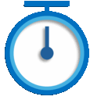</p>
<p align="center"></p>

# Stop Watch - VS Code拡張機能

**Stop Watch**は、エクスプローラーのアクションバーにストップウォッチタブを追加し、ステータスバーに経過時間を表示する拡張機能です。

### 動作例

<p align="center">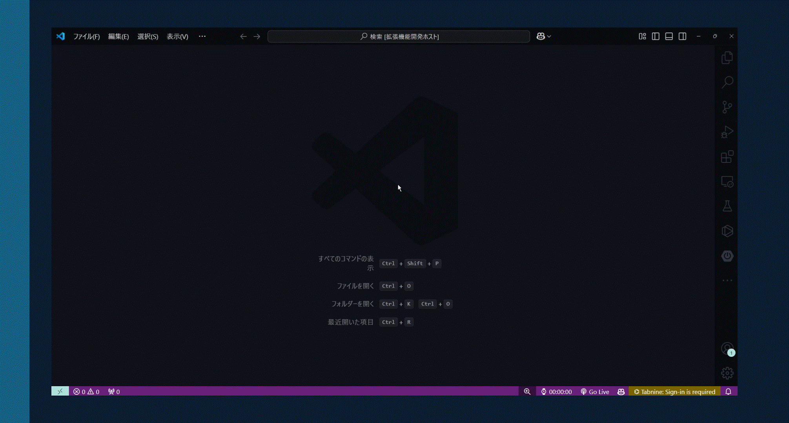</p>

## インストール💻

この拡張機能のインストール方法は2通りです：

- [Visual Studio Marketplace](https://marketplace.visualstudio.com/items?XXXX)からインストール
- エディタの拡張機能タブで `Stop Watch` を検索

## 機能🚀

- **ステータスバー統合**: ステータスバーに経過時間を表示
- **Webviewインターフェース**: ストップウォッチを操作するインタラクティブなWebviewインターフェース
- **開始、停止、リセット**: ストップウォッチの開始、停止、リセットを簡単に操作
- **カスタマイズ可能な表示**: テーマ切り替えボタンでダークモードとライトモードを切り替え
- **カスタムフォント**: `DSEG`, `Orbitron` などのフォントに対応

## 使い方💡

1. エクスプローラーのアクションバーでストップウォッチタブを開きます。
2. 表示されたストップウォッチを使って、`開始`、`停止`、または`リセット`を行い、時間を確認できます。（[動作例](#動作例)を参照）
3. ステータスバーでも時間を確認できます。

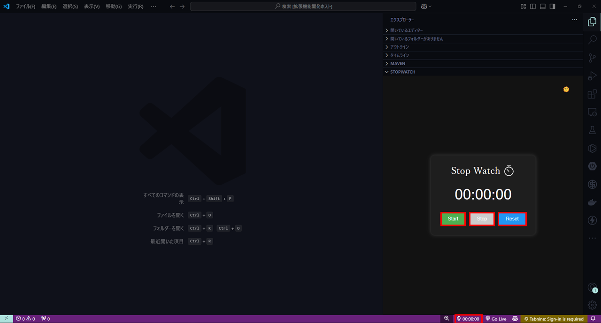

## 設定⚙️

### settings.json
`settings.json`ファイルで拡張機能の[設定](https://code.visualstudio.com/docs/customization/userandworkspace)を変更できます：

- `stopwatch.setStatusBarPosition`: ステータスバーアイテムの位置を制御します。選択肢は`Left`または`Right`。
- `stopwatch.switchFont`: ストップウォッチの表示フォントを制御します。利用可能なフォントは`Arial, sans-serif`、`DSEG-Regular`、`DSEG-Bold`、`Orbitron`、`RampartOne`、`瀞ノグリッチ`、`851Gkktt`、`rycsminStencily`、`Isego`です。

設定例
```json
// settings.json
{
  "stopwatch.setStatusBarPosition": "Left",
  "stopwatch.switchFont": "DSEG-Regular"
}
```

### フォント設定

`stopwatch.switchFont`を設定した場合の使用例を示します。

<table>
  <tr>
    <td>
        <p>Arial, sans-serif (デフォルト)</p>
        </img>
    </td>
    <td>
        <p>DSEG-Regular</p>
        </img>
    </td>
  </tr>
  <tr>
    <td>
        <p>DSEG-Bold</p>
        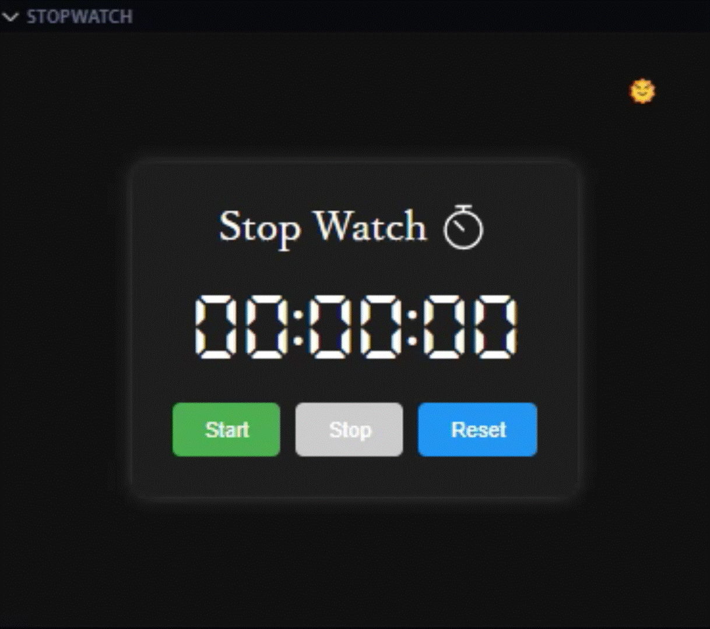</img>
    </td>
    <td>
        <p>Orbitron</p>
        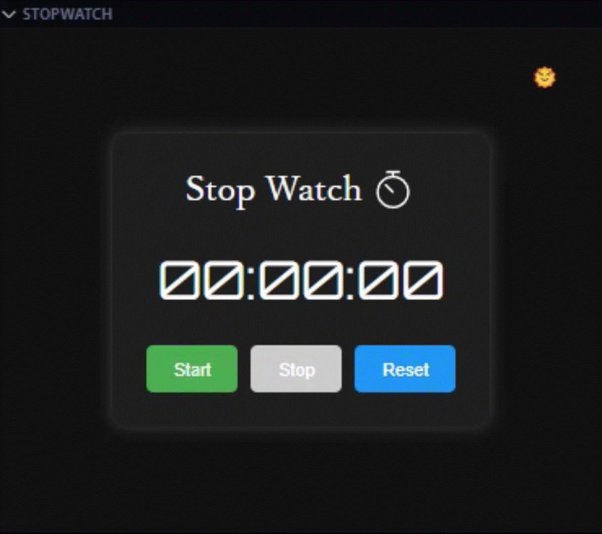</img>
    </td>
  </tr>
  <tr>
    <td>
        <p>RampartOne</p>
        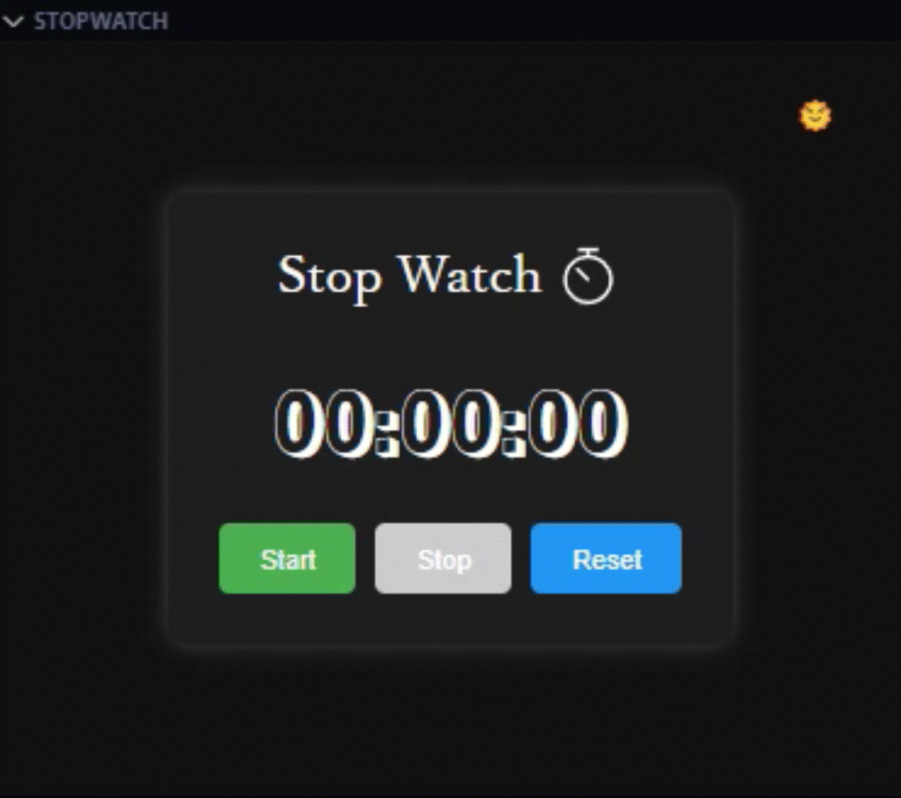</img>
    </td>
    <td>
        <p>瀞ノグリッチ</p>
        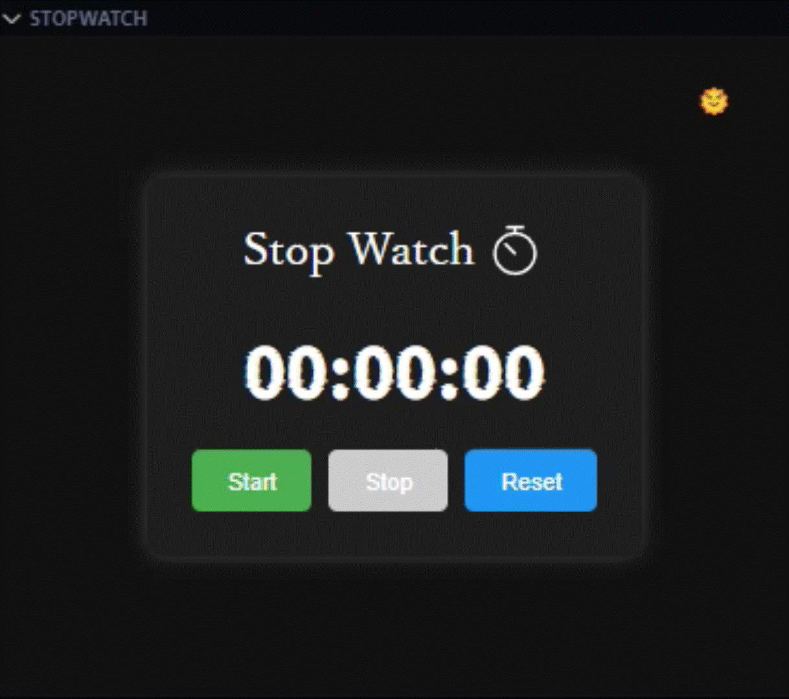</img>
    </td>
  </tr>
  <tr>
    <td>
        <p>851Gkktt</p>
        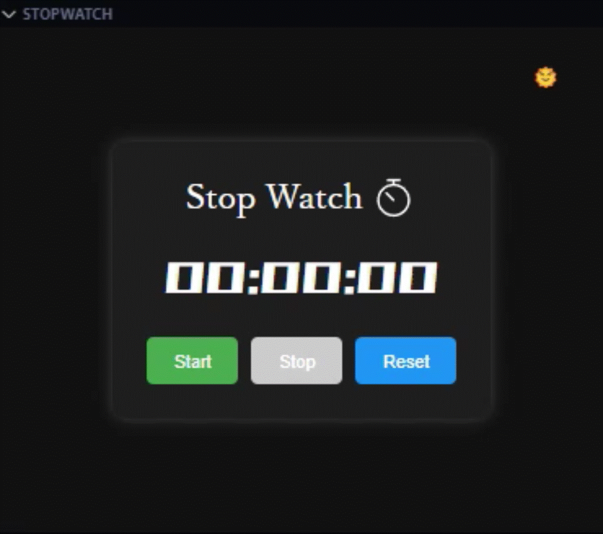</img>
    </td>
    <td>
        <p>rycsminStencily</p>
        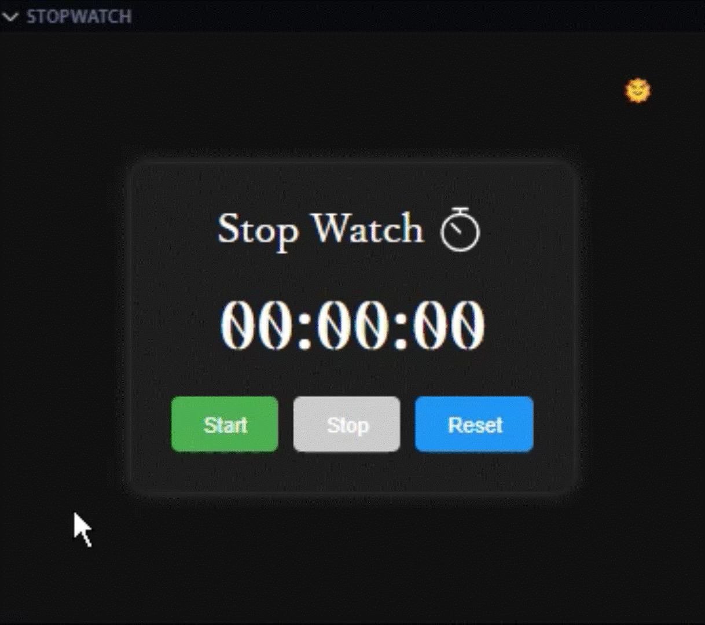</img>
    </td>
  </tr>
  <tr>
    <td>
        <p>Isego</p>
        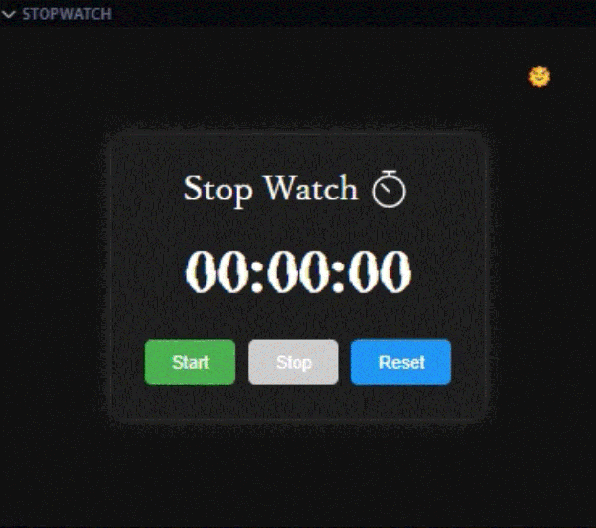</img>
    </td>
    <td>
    </td>
  </tr>
</table>

### ダークモード / ライトモード
ダークモード / ライトモード機能では、🌙ボタンを押すとダークモードに、🌞ボタンを押すとライトモードに切り替えができます。<br>
以下はその使用例です。

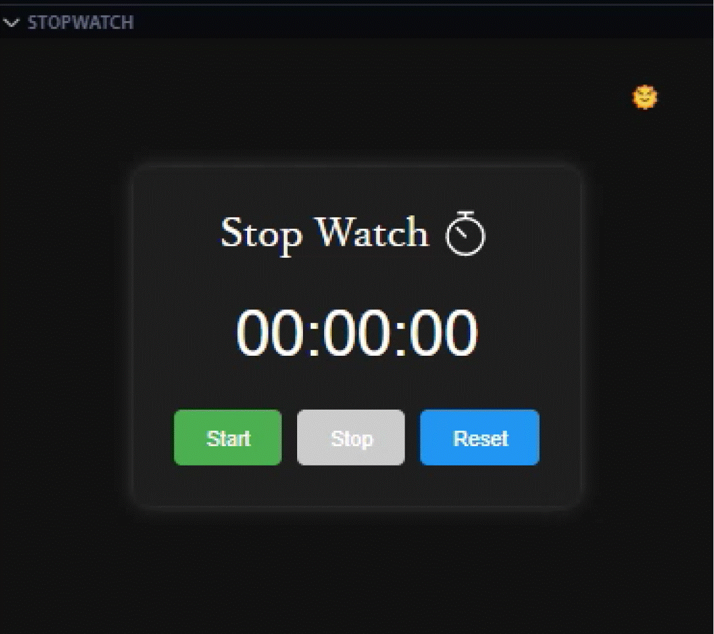</img>

## 変更履歴📝

すべての変更内容は[CHANGELOG](./CHANGELOG.md)で確認できます。

## ライセンス⚖️

[MIT](./LICENSE)

<hr>

是非試してみてください！ ⏱️