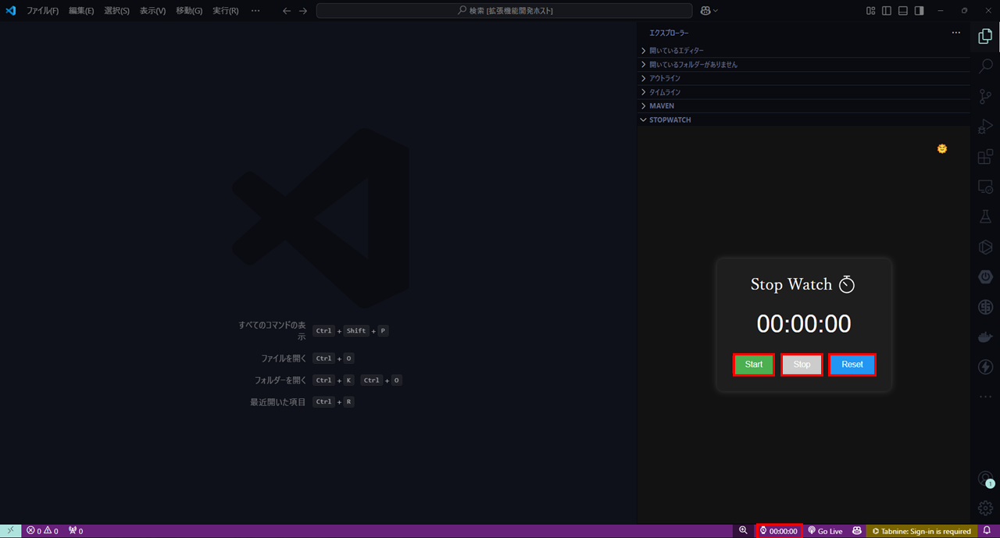
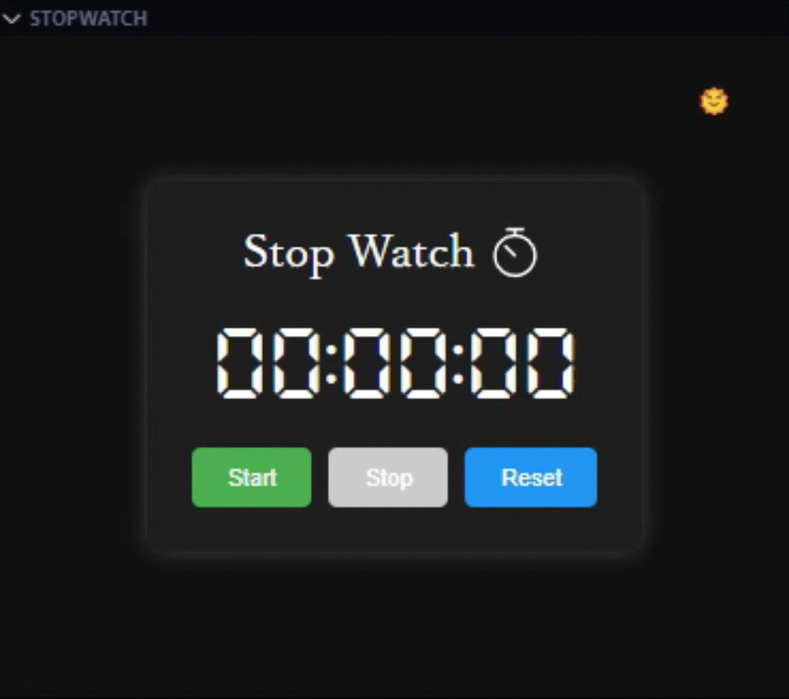
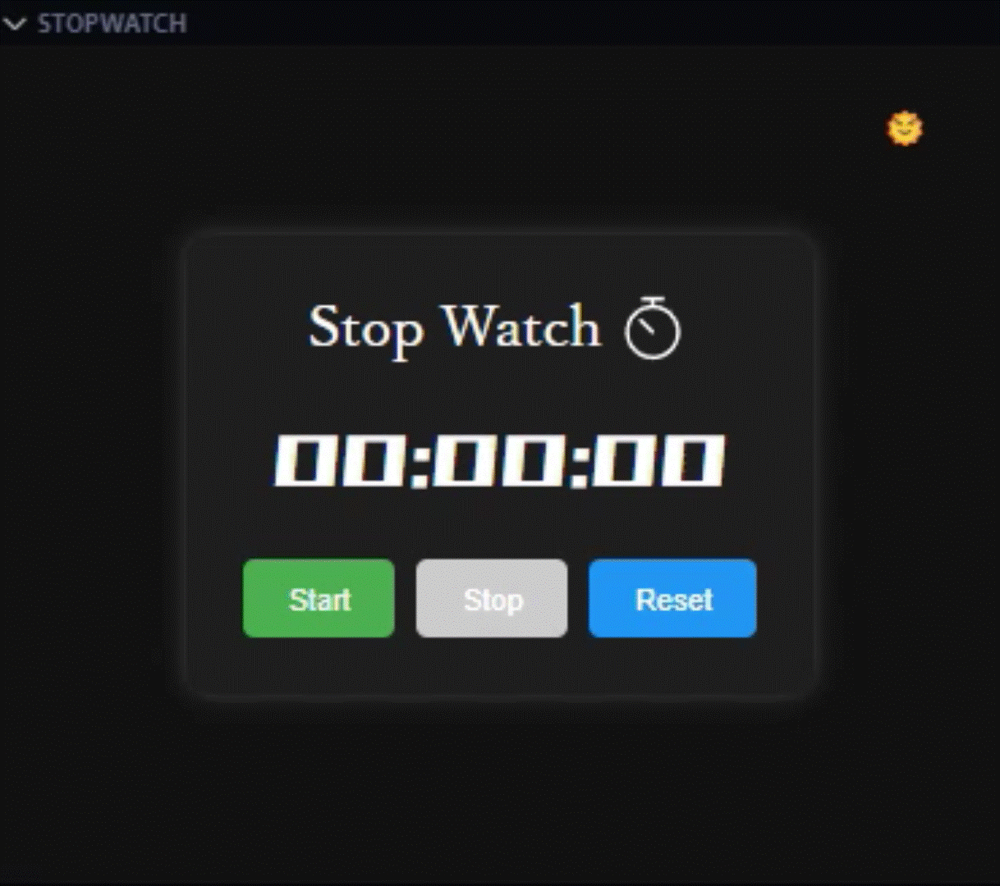

<div align="right" style="font-size: 20px;">

**English** | [日本語](./README.ja.md)

</div>

<p align="center"></p>
<p align="center"></p>


# Stop Watch - VS Code Extension

**Stop Watch** is an extension that adds a stopwatch tab to the Explorer action bar and displays the elapsed time in the status bar.

### Demo

<p align="center"></p>

## Installation💻

There are 2 ways to install this extension:

- Install from [Visual Studio Marketplace](https://marketplace.visualstudio.com/items?XXXX).
- Search for `Stop Watch` in the extensions tab in the editor

## Features🚀

- **Status Bar Integration**: Shows the elapsed time in the status bar.
- **Webview Interface**: An interactive webview interface for controlling the stopwatch.
- **Start, Stop, Reset**: Simple controls to start, stop, and reset the stopwatch.
- **Customizable Display**: Switch between dark and light mode with a theme toggle button.
- **Custom Fonts**: Supports various fonts, including `DSEG`, `Orbitron`, and more.

## Usage💡

1. Open the action bar in the Explorer and navigate to the Stopwatch tab.
2. Use the displayed stopwatch to `start`, `stop`, or `reset` the timer, and check the time. (Refer to:[Demo](#demo)).
3. You can also check the time from the status bar.



## Configuration⚙️

### Settings.json
You can configure the extension [settings](https://code.visualstudio.com/docs/customization/userandworkspace) in your `settings.json` file:

- `stopwatch.setStatusBarPosition`: Controls the position of the status bar item. Options are `Left` or `Right`.
- `stopwatch.switchFont`: Controls the font of the stopwatch display. Available fonts include `Arial, sans-serif`, `DSEG-Regular`, `DSEG-Bold`, `Orbitron`, `RampartOne`, `瀞ノグリッチ`, `851Gkktt`, `rycsminStencily`, and `Isego`.

Example Configuration
```json
// settings.json
{
  "stopwatch.setStatusBarPosition": "Left",
  "stopwatch.switchFont": "DSEG-Regular"
}
```

### Font Settings

When setting `stopwatch.switchFont`, here is an example of usage.

<table>
  <tr>
    <td>
        <p>Arial, sans-serif (default)</p>
        </img>
    </td>
    <td>
        <p>DSEG-Regular</p>
        </img>
    </td>
  </tr>
  <tr>
    <td>
        <p>DSEG-Bold</p>
        </img>
    </td>
    <td>
        <p>Orbitron</p>
        </img>
    </td>
  </tr>
  <tr>
    <td>
        <p>RampartOne</p>
        </img>
    </td>
    <td>
        <p>瀞ノグリッチ</p>
        </img>
    </td>
  </tr>
  <tr>
    <td>
        <p>851Gkktt</p>
        </img>
    </td>
    <td>
        <p>rycsminStencily</p>
        </img>
    </td>
  </tr>
  <tr>
    <td>
        <p>Isego</p>
        </img>
    </td>
    <td>
    </td>
  </tr>
</table>

### Dark Mode / White Mode
The Dark Mode / Light Mode feature allows you to switch to Dark Mode by pressing the 🌙 button, and to Light Mode by pressing the 🌞 button.<br>
Here is an example of how to use it.

</img>

## Change Log📝

You can checkout all our changes in our [CHANGELOG](./CHANGELOG.md).

## LICENSE⚖️

[MIT](./LICENSE)

<hr>

Please give it a try! ⏱️